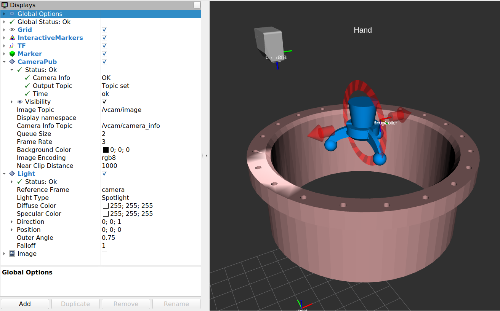
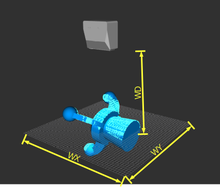
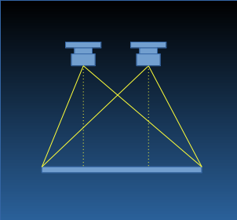

# Virtual 3D Camera

## 必要ROSパッケージ
### バーチャル2Dカメラ

~~~
git clone https://github.com/lucasw/rviz_camera_stream.git
~~~

### 照明

~~~
git clone https://github.com/mogumbo/rviz_lighting
~~~

### Smart Robot Integrator

~~~
git clone https://github.com/CA-Giken/smabo
~~~

## Rviz設定  

スクリーンショット参照

## Launch
### シーン生成
~~~
roslaunch vcam3d env.launch
~~~

### Rviz起動
~~~
roslaunch vcam3d viewer.launch
~~~

### ハンド起動
~~~
script/hand.py
~~~

## カメラインタフェース標準化

### Publisher
| name | type | description | mandatory |
|:-----|:-----|:------------|:----------|
|~pc2|PointCloud2|点群| Yes |
|~Y1|Bool|出力完了通知。streaming時は出力しない。| Yes |
|camera_info|CameraInfo|[カメラ情報](#CameraInfo)|  |

### Subscriber
| name | type | description | mandatory |
|:-----|:-----|:------------|:----------|

### Config
名前空間:  /config/<クラス>
| name | type | description |
|:-----|:-----|:------------|
|WD|Number|基準距離(mm)|
|WX|Number|基準距離での視野幅(mm)|
|WY|Number|基準距離での視野高(mm)|
|width|Number|投影面の幅(px)|
|height|Number|投影面の高(px)|

### Param
名前空間: /<インスタンス>
| name | type | description |
|:-----|:-----|:------------|
|exposure|Number|カメラ露出|
|intensity|Number|照明強度|
|gain|Number|カメラゲイン|
|streaming|Bool|ストリーミング有効/無効|

## CameraInfo  
3Dカメラの基本仕様として示されるのは、基準距離(WD)における視野(WX&times;WY)である。2Dカメラのシミュレータは、カメラパラメータを必要とするので、視野情報と投影面のピクセル数から、妥当な情報を生成して、CameraInfoトピックとして出力します。

必要な、行列は、K行列(P行列は計算前でよい)のみですが、ステレオカメラの場合は、投影面が共用されなければいけないので、注意ください。
リアルワールドでは、視野を重ねるため左右カメラそれぞれの光軸を内側へ向けますが、仮想カメラでは投影面をそれぞれずらせばいいのか?

